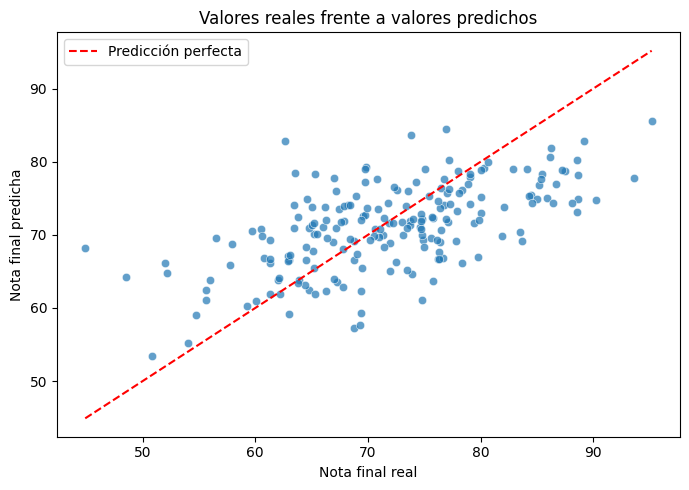
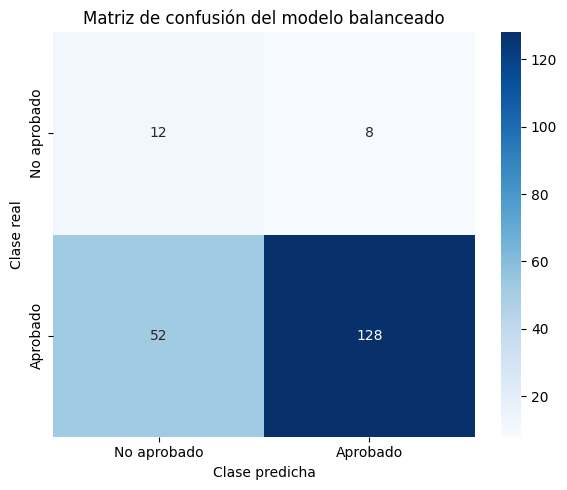

# Machine Learning: Regresión y Clasificación

## Descripción del proyecto

Este proyecto tiene como objetivo aplicar diferentes técnicas de Machine Learning sobre un conjunto de datos relacionado con el rendimiento académico de estudiantes.

El trabajo se divide en dos problemas:

- Un problema de **regresión**, cuyo objetivo es predecir la nota final de cada estudiante.
- Un problema de **clasificación**, cuyo objetivo es predecir si el estudiante aprobará o no.

Para resolver ambos problemas se ha realizado un análisis exploratorio de los datos, un proceso de limpieza y preparación de las variables, el entrenamiento de los modelos y una evaluación de los resultados obtenidos.

## Objetivos

Los principales objetivos del proyecto son:

- Analizar la estructura y el contenido del dataset.
- Detectar valores nulos, registros duplicados y posibles problemas de calidad.
- Estudiar la distribución y relación entre las variables.
- Preparar los datos para su utilización en modelos de Machine Learning.
- Entrenar un modelo de regresión lineal para predecir `nota_final`.
- Entrenar un modelo de regresión logística para predecir `aprobado`.
- Evaluar los modelos utilizando métricas adecuadas para cada problema.
- Analizar el efecto del desequilibrio de clases en el modelo de clasificación.
- Comprobar la estabilidad de los resultados mediante validación cruzada.

## Dataset

El dataset contiene 1000 registros y 11 columnas relacionadas con los hábitos de estudio y el rendimiento académico de los estudiantes.

### Variables predictoras

- `horas_estudio_semanal`: número de horas de estudio a la semana.
- `nota_anterior`: nota obtenida en la convocatoria anterior.
- `tasa_asistencia`: porcentaje de asistencia a clase.
- `horas_sueno`: promedio de horas de sueño al día.
- `edad`: edad del estudiante.
- `nivel_dificultad`: dificultad percibida para el estudio.
- `tiene_tutor`: indica si el estudiante cuenta con tutor.
- `horario_estudio_preferido`: momento del día preferido para estudiar.
- `estilo_aprendizaje`: forma principal de aprendizaje del estudiante.

### Variables objetivo

- `nota_final`: variable continua entre 0 y 100 utilizada en el modelo de regresión.
- `aprobado`: variable binaria utilizada en clasificación. Toma el valor 1 cuando la nota final es igual o superior a 60 y el valor 0 en caso contrario.

## Estructura del repositorio 


```text
Proyecto_08_DS.Machine_learning_regresion_y_clasificacion/
│
├── Data/
│   ├── processed/
│   │   └── dataset_estudiantes_limpio.csv
│   │
│   └── raw/
│       └── dataset_estudiantes.csv
│
├── Images/
│   ├── 01_regresion_real_predicho.png
│   └── 02_matriz_confusion_balanceado.png
│
├── Notebook/
│   ├── 01_eda_preliminar.ipynb
│   ├── 02_preprocesamiento.ipynb
│   └── 03_modelado_regresion_clasificacion.ipynb
│
├── src/
│   ├── __init__.py
│   └── model_utils.py
│
├── .gitignore
├── README.md
└── requirements.txt
```

## Organización del proyecto

### 1. Análisis exploratorio

El notebook `01_eda_preliminar.ipynb` contiene el análisis exploratorio del conjunto de datos.

En esta fase se realizaron las siguientes tareas:

- Revisión de dimensiones y tipos de datos.
- Análisis de valores nulos y duplicados.
- Estadísticas descriptivas.
- Análisis univariante de variables numéricas y categóricas.
- Análisis bivariante respecto a `nota_final`.
- Análisis bivariante respecto a `aprobado`.
- Matriz de correlación.
- Revisión del desequilibrio de la variable objetivo de clasificación.

El análisis mostró que las variables con una relación más clara con el rendimiento académico eran `horas_estudio_semanal`, `nota_anterior`, `tasa_asistencia` y `tiene_tutor`.

También se observó un desequilibrio importante en la variable `aprobado`:

- Aprobados: 89,8%.
- No aprobados: 10,2%.

Este desequilibrio se tuvo en cuenta posteriormente en la evaluación del modelo de clasificación.

### 2. Preprocesamiento

El notebook `02_preprocesamiento.ipynb` contiene la limpieza inicial del dataset.

Las principales transformaciones fueron:

- Imputación de los valores nulos de `horas_sueno` mediante la mediana.
- Sustitución de los valores nulos de `horario_estudio_preferido` y `estilo_aprendizaje` por la categoría `Desconocido`.
- Comprobación de registros duplicados.
- Revisión de tipos de datos y categorías.
- Guardado del conjunto de datos limpio en `Data/processed`.

Durante la revisión se comprobó que las categorías mantenían una escritura consistente. Por este motivo, no fue necesario convertir los textos a minúsculas, eliminar acentos o modificar sus separadores.

### 3. Modelado

El notebook `03_modelado_regresion_clasificacion.ipynb` contiene la preparación de variables, el entrenamiento de los modelos y su evaluación.

El preprocesamiento utilizado durante el modelado incluye:

- Escalado de variables numéricas mediante `StandardScaler`.
- Codificación de variables categóricas mediante `OneHotEncoder`.
- Uso de `ColumnTransformer` para aplicar cada transformación al tipo de variable correspondiente.
- Integración del preprocesamiento y los modelos mediante pipelines.
- División de los datos en un 80% para entrenamiento y un 20% para prueba.
- Estratificación de la variable objetivo en el problema de clasificación.

La variable `nota_final` no se utiliza para predecir `aprobado`, ya que `aprobado` se calcula directamente a partir de la nota final. Incluirla como variable predictora provocaría fuga de información.

## Modelo de regresión lineal

El modelo de regresión lineal se utilizó para predecir la variable `nota_final`.

### Resultados en el conjunto de prueba

| Métrica | Resultado |
|---|---:|
| MAE | 5,816 |
| RMSE | 7,247 |
| R² | 0,358 |

El MAE indica que las predicciones se alejan, por término medio, aproximadamente 5,8 puntos de las notas reales.

El modelo explica aproximadamente el 35,8% de la variabilidad de la nota final. Además, mejora los resultados de una predicción básica basada únicamente en la nota media del conjunto de entrenamiento.

### Comparación con el modelo de referencia

| Métrica | Regresión lineal | Modelo de referencia |
|---|---:|---:|
| MAE | 5,816 | 7,248 |
| RMSE | 7,247 | 9,057 |
| R² | 0,358 | -0,003 |

Los resultados muestran que las variables predictoras aportan información útil para estimar la nota final.

No obstante, las predicciones tienden a concentrarse alrededor de valores intermedios. Esto provoca que algunas notas bajas sean sobreestimadas y algunas notas altas sean subestimadas.

### Valores reales frente a valores predichos



### Validación cruzada de regresión

| Métrica | Media | Desviación estándar |
|---|---:|---:|
| MAE | 6,198 | 0,340 |
| RMSE | 7,741 | 0,434 |
| R² | 0,358 | 0,038 |

La validación cruzada confirma que el modelo mantiene un comportamiento relativamente estable entre las diferentes particiones.

## Modelo de regresión logística

El modelo de regresión logística se utilizó para predecir la variable `aprobado`.

Debido al desequilibrio entre clases, se compararon dos versiones:

- Regresión logística inicial.
- Regresión logística con `class_weight="balanced"`.

### Modelo inicial

| Métrica | Resultado |
|---|---:|
| Accuracy | 0,895 |
| Balanced accuracy | 0,564 |
| Precision no aprobado | 0,429 |
| Recall no aprobado | 0,150 |
| F1 no aprobado | 0,222 |

Aunque el accuracy es elevado, el modelo inicial solo identifica correctamente a 3 de los 20 estudiantes no aprobados del conjunto de prueba.

Esto demuestra que el accuracy no resulta suficiente para evaluar un problema con clases desequilibradas.

### Modelo balanceado

| Métrica | Resultado |
|---|---:|
| Accuracy | 0,700 |
| Balanced accuracy | 0,656 |
| Precision no aprobado | 0,188 |
| Recall no aprobado | 0,600 |
| F1 no aprobado | 0,286 |

El modelo balanceado identifica correctamente a 12 de los 20 estudiantes no aprobados.

El recall aumenta del 15% al 60%, aunque esta mejora produce una disminución del accuracy y un mayor número de estudiantes aprobados clasificados incorrectamente como no aprobados.

### Matriz de confusión del modelo balanceado



### Resultados medios de validación cruzada

| Métrica | Modelo inicial | Modelo balanceado |
|---|---:|---:|
| Accuracy | 0,895 | 0,760 |
| Balanced accuracy | 0,557 | 0,730 |
| Precision no aprobado | 0,553 | 0,254 |
| Recall no aprobado | 0,133 | 0,693 |
| F1 no aprobado | 0,200 | 0,371 |

La validación cruzada mantiene el mismo patrón observado en el conjunto de prueba.

El modelo inicial consigue un mayor porcentaje global de aciertos, pero presenta muchas dificultades para detectar a los estudiantes no aprobados.

El modelo balanceado reduce el accuracy, pero mejora claramente el balanced accuracy, el recall y el f1-score de la clase minoritaria.

## Selección del modelo de clasificación

La elección del modelo depende del objetivo que se quiera priorizar.

Si el objetivo fuera maximizar el porcentaje total de predicciones correctas, el modelo inicial sería la opción más adecuada. Sin embargo, esta versión apenas identifica a los estudiantes no aprobados.

En este proyecto se considera más útil detectar posibles casos de riesgo académico. Por este motivo, se selecciona la regresión logística con `class_weight="balanced"`.

Las predicciones de no aprobado deberían interpretarse como señales de alerta para revisar cada caso con mayor detalle, y no como una decisión definitiva, ya que el modelo genera falsos avisos.

## Funciones reutilizables

El archivo `src/model_utils.py` contiene funciones auxiliares utilizadas durante la evaluación de los modelos.

Entre ellas se incluyen funciones para:

- Calcular las métricas de regresión.
- Representar valores reales frente a valores predichos.
- Analizar los residuos del modelo.
- Calcular métricas de clasificación.
- Generar matrices de confusión.
- Crear informes de clasificación.

Esta organización permite reducir código repetido y mantener el notebook de modelado más ordenado.

## Tecnologías utilizadas

- Python
- pandas
- NumPy
- Matplotlib
- Seaborn
- scikit-learn
- Jupyter Notebook
- Visual Studio Code
- Git y GitHub

## Instalación y ejecución

### 1. Clonar el repositorio

### 2. Acceder a la carpeta del proyecto

### 3. Crear un entorno virtual

### 4. Activar el entorno virtual

### 5. Instalar las dependencias

### 6. Ejecutar los notebooks

Los notebooks deben ejecutarse en este orden:

```text
1. Notebook/01_eda_preliminar.ipynb
2. Notebook/02_preprocesamiento.ipynb
3. Notebook/03_modelado_regresion_clasificacion.ipynb
```

El segundo notebook genera el archivo procesado utilizado posteriormente durante el modelado.

## Conclusiones

Los resultados muestran que las variables disponibles contienen información útil para estimar el rendimiento académico de los estudiantes.

La regresión lineal mejora una predicción basada únicamente en la media y mantiene resultados estables durante la validación cruzada. Sin embargo, explica una parte moderada de las diferencias entre las notas finales.

En clasificación, el principal problema es el desequilibrio entre estudiantes aprobados y no aprobados. El modelo inicial obtiene un accuracy elevado, pero apenas detecta estudiantes de la clase minoritaria.

El uso de pesos balanceados permite identificar una proporción mucho mayor de estudiantes no aprobados, aunque también aumenta el número de falsos avisos.

Como posibles mejoras futuras, sería interesante disponer de más registros de estudiantes no aprobados, incluir nuevas variables relacionadas con el rendimiento académico y comparar los resultados con modelos capaces de representar relaciones no lineales.

## Autor

Juan Pablo Planelles